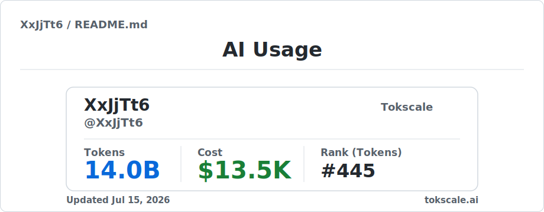
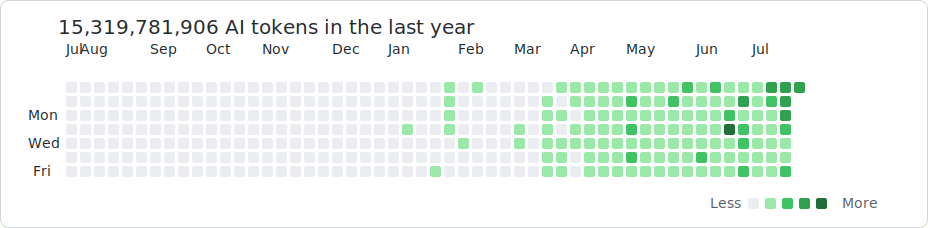

<!--
Generated from Tokscale graph data.
Only aggregate token, cost, model and client counts are exported.
-->

# XxJjTt6

**AI-native builder | local agents | automation loops**

## AI Usage

| Window | Tokens | Cost |
| --- | ---: | ---: |
| Today | 102,254,285 | $99.61 |
| This week | 102,254,285 | $99.61 |
| This month | 2,823,758,114 | $2,738.16 |
| Last 7 days | 1,390,126,763 | $1,175.33 |
| Last 30 days | 6,700,408,749 | $6,611.53 |
| All time | 13,081,278,453 | $12,274.45 |

## Sources

| Source | Tokens | Cost | Messages |
| --- | ---: | ---: | ---: |
| Codex | 9,779,714,932 | $8,931.33 | 73,982 |
| Claude Code | 3,290,537,377 | $3,343.13 | 21,343 |

## Models

| Model | Tokens | Cost | Messages |
| --- | ---: | ---: | ---: |
| gpt-5.5 | 8,610,026,374 | $8,176.14 | 66,164 |
| claude-opus-4-8 | 2,979,877,287 | $2,787.67 | 19,205 |
| gpt-5.6-sol | 647,784,657 | $453.87 | 3,291 |
| gpt-5.4 | 494,229,448 | $287.20 | 4,163 |
| claude-fable-5 | 282,439,868 | $547.66 | 1,291 |
| claude-haiku-4-5 | 28,024,020 | $6.87 | 653 |
| gpt-5.3-codex | 22,730,977 | $10.82 | 235 |
| gpt-5.2-codex | 4,848,555 | $3.21 | 123 |

Updated 2026-07-13. Data generated by Tokscale 4.5.0; local aggregate logs only.
